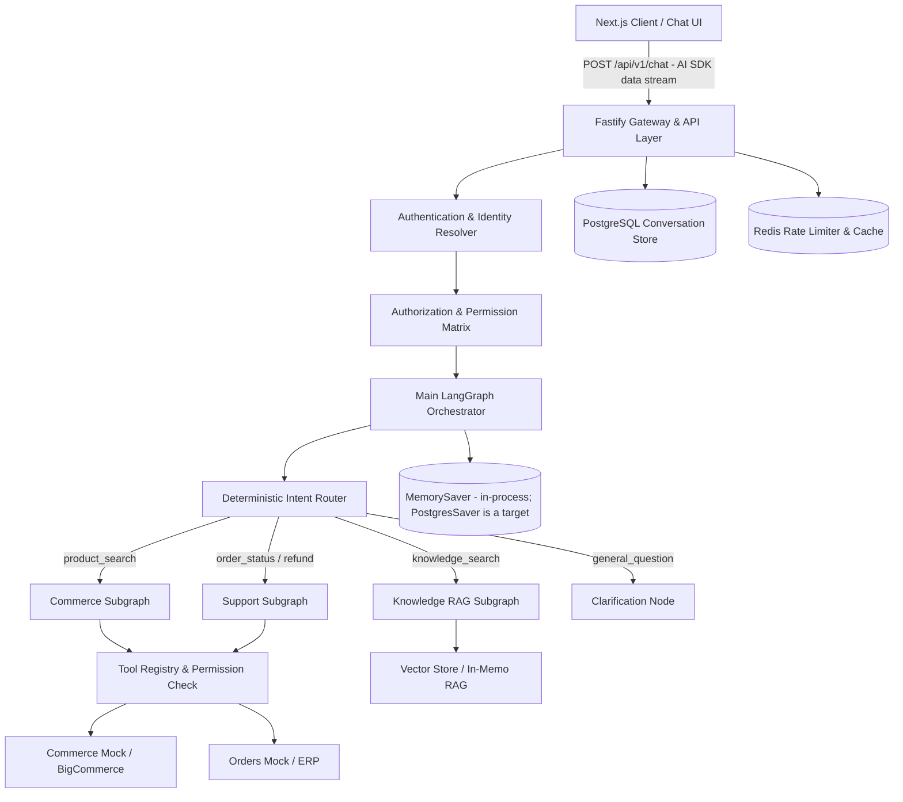

# AI Service Architecture Guide

## Overview

The `ai-service` is an enterprise AI orchestration and API backend built with **Node.js**, **Fastify**, **LangGraph.js**, **PostgreSQL**, and **Redis**. It is completely decoupled from the presentation layer (`chatbot-web`) and exposes a versioned REST API plus a streaming chat endpoint that speaks the **Vercel AI SDK data stream protocol** (not SSE — see `streaming.md`).

---

## Architectural Principles

1. **Why Two Independent Repositories?**
   - **Frontend vs Backend Lifecycle**: Frontend UI iterations happen rapidly and deploy directly to edge/serverless networks (e.g., Vercel, Cloudflare Pages). Orchestration services require stateful connections, background tasks, long-running agent threads, and specialized database checkpointing that deploy to container platforms (AWS ECS, Kubernetes, Cloud Run).
   - **Zero Leaked Secrets**: Frontend never touches LLM API keys, ERP credentials, or database connection strings.
   - **Independent Scaling**: Compute-heavy LLM token processing scales separately from lightweight HTTP UI traffic.

2. **Why LangGraph.js?**
   - **Deterministic Agentic Workflows**: Unlike unpredictable black-box autonomous agents, LangGraph provides stateful cyclic graphs, conditional routing, guardrails, and deterministic checkpoints.
   - **Human-In-The-Loop**: Native interrupt and resume capabilities allow high-value financial actions (e.g. refunds > ₹5,000) to halt graph execution, wait for supervisor review, and resume safely without lost state.
   - *Status*: the deterministic routing, cyclic commerce loop and guardrails are built. The
     HITL **interrupt/resume** mechanism is **not** — `human_approval` currently detects and
     reports the approval requirement but does not interrupt the graph. See
     `langgraph-workflows.md` §4 for the required shape.

3. **Why Fastify?**
   - Superior throughput, schema-based JSON serialization, built-in Swagger/OpenAPI support, and minimal overhead for low-latency streaming endpoints.

4. **Normalized Identity Model**
   - The entire LangGraph and tool layer works solely with a normalized `UserIdentity` object (`id`, `type: 'guest' | 'external' | 'internal'`, `roles`, `permissions`, `tenantId`).
   - Authentication adapters (Mock, Entra ID, Auth0) normalize provider claims before any graph logic executes.
