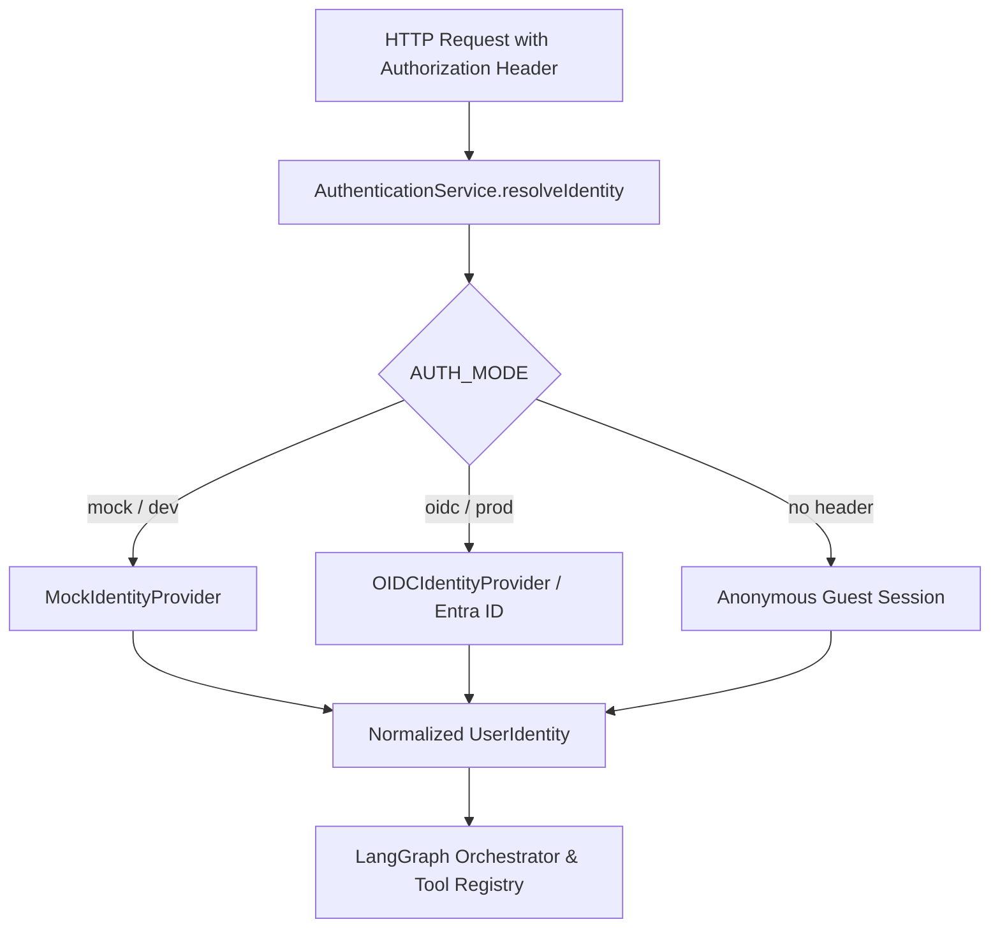

# Authentication & Identity Architecture

## Overview
Authentication answers **"Who is this user?"**

The AI Chatbot Platform supports three distinct identity models without hard-coding provider logic into graph nodes:
1. **Guest Visitor**: Anonymous session with public rate limits and read-only catalog access.
2. **External User**: Customer authenticated via OAuth2/OIDC (e.g. Auth0, Google, Okta).
3. **Internal User**: Enterprise employee authenticated via Microsoft Entra ID / corporate SSO.



---

## Normalized User Identity
Every layer of the AI application consumes this unified interface:
```typescript
interface UserIdentity {
  id: string;
  type: "guest" | "external" | "internal";
  provider?: string;
  subject?: string;
  email?: string;
  name?: string;
  roles: string[];
  permissions: string[];
  tenantId?: string;
}
```

---

## Production Microsoft Entra ID Configuration
To connect enterprise Microsoft Entra ID in production:
1. Set `.env`:
   ```env
   AUTH_MODE=oidc
   INTERNAL_SSO_ENABLED=true
   OIDC_ISSUER=https://login.microsoftonline.com/{TENANT_ID}/v2.0
   OIDC_CLIENT_ID={CLIENT_ID}
   OIDC_CLIENT_SECRET={CLIENT_SECRET}
   OIDC_AUDIENCE=api://ai-service
   ```
2. The `OIDCIdentityProvider` automatically validates JWT claims and normalizes tenant and role assignments.
