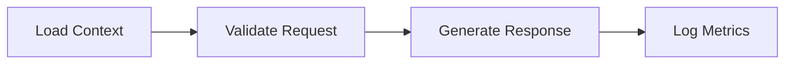
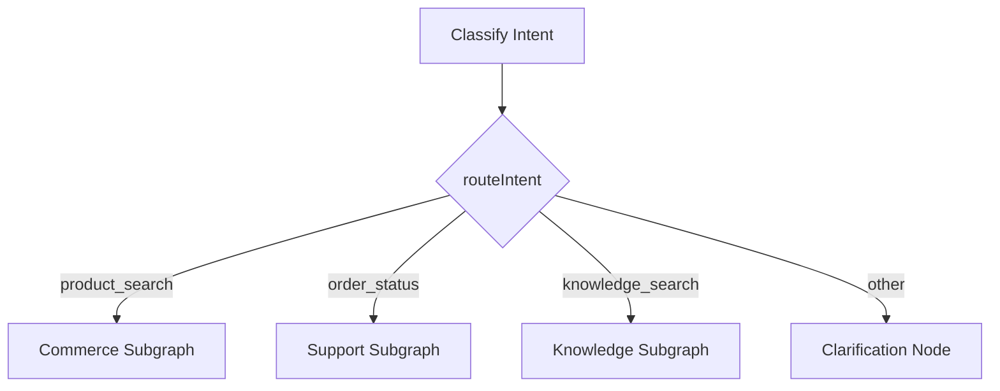
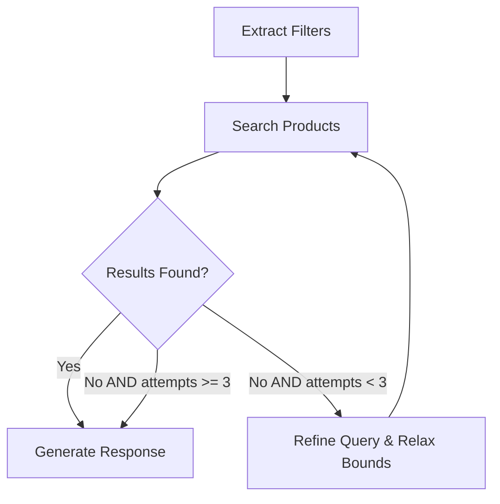
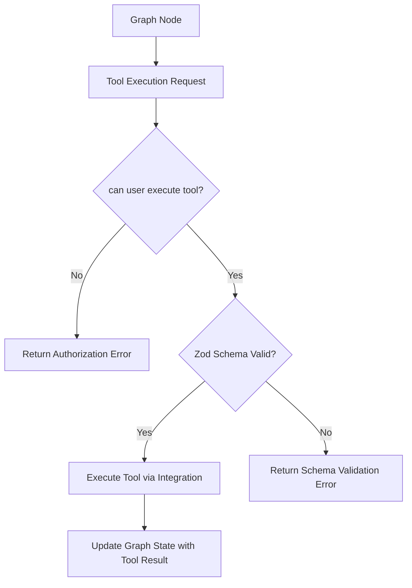
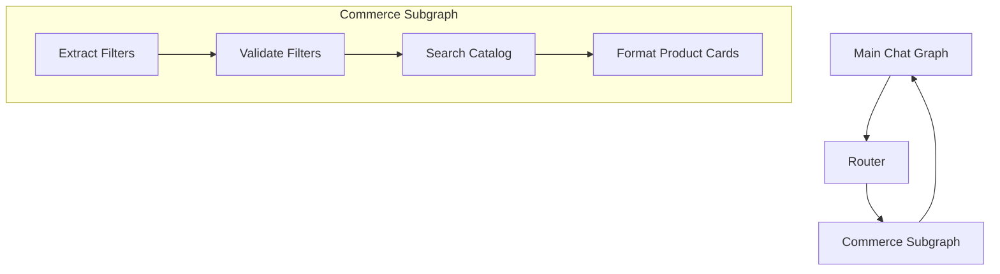
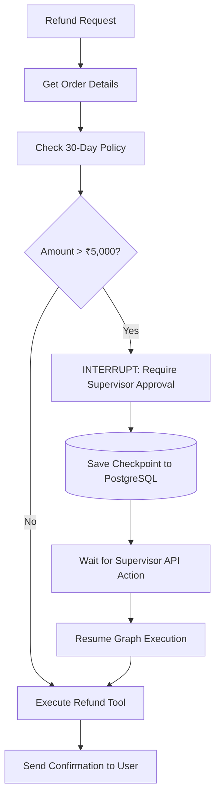

# LangGraph Design Patterns & Workflows

This document details the core architectural patterns implemented in the AI Chatbot Platform using **LangGraph.js**.

---

## 1. Linear Graph

Linear graphs execute steps in a strict, predictable sequence where each node transforms the state and passes it to the next.

---

## 2. Conditional Routing

Conditional edges evaluate state properties and route to appropriate successor nodes.

---

## 3. Graph Loops & Iteration Bounds

Loops allow graphs to refine outputs or retry operations until a condition is satisfied. Every loop **must** have an upper bound (`MAX_SEARCH_ATTEMPTS = 3`) to prevent infinite recursion and token exhaustion.

---

## 4. Controlled Tool Calling

Tools represent external capabilities. The LLM suggests tool parameters, but the application validates input schemas with Zod and enforces server-side permission checks.

---

## 5. Subgraphs & Hierarchical Composition

Subgraphs encapsulate specialized domain logic. The Main Graph acts as a coordinator, delegating tasks to subgraphs that maintain their own internal state transitions.

---

## 6. Human-In-The-Loop (Interrupt & Checkpoint)

High-stakes operations (e.g. monetary refunds > ₹5,000) trigger human approval workflows. The graph interrupts execution and yields control until a human supervisor submits approval.

---

## 7. Deterministic Workflows vs Autonomous Agents

**The Golden Rule**: *Do not use an autonomous agent when a deterministic workflow is sufficient.*

| Aspect | Pure Autonomous Agent | LangGraph Hybrid Architecture (Used Here) |
| :--- | :--- | :--- |
| **Routing** | LLM guesses next step freely | Deterministic router based on structured intent |
| **Security** | LLM can be prompt-injected into bypassing checks | Server-side permission guards check every tool execution |
| **Financial Actions** | Agent calls refund tool directly | Hard rule-based validation + Human-In-The-Loop approval |
| **Predictability** | High variance & hallucination risk | Low variance, deterministic state transitions |
