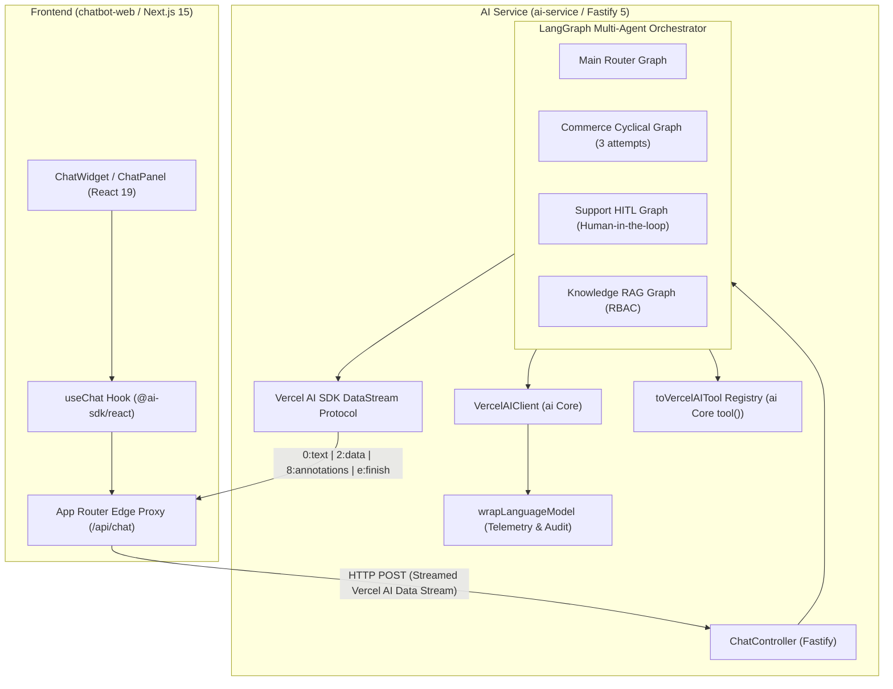

# Enterprise Vercel AI SDK + LangGraph End-to-End Architecture

This document details the complete end-to-end integration of **Vercel AI SDK** with **LangGraph.js** across both the **Web Client** (`chatbot-web`) and the **Autonomous AI Service** (`ai-service`).

---

## 1. High-Level System Architecture



---

## 2. Enterprise Features of Vercel AI SDK in This Platform

### Feature 1: Native Data Stream Protocol (`X-Vercel-AI-Data-Stream: v1`)
The platform transmits all responses using the official Vercel AI SDK Data Stream Protocol:
- `0:"<delta>"\n`: Real-time streaming assistant text deltas.
- `2:[{"type":"tool-start", ...}]\n`: Real-time status updates on graph state transitions and active tool invocations.
- `8:[{...}]\n`: Rich message annotations (Generative UI payloads such as product cards, order lookups, supervisor approval prompts, and citations).
- `e:{"finishReason":"stop", "usage":{...}}\n`: Standardized stream termination with precise prompt and completion token counts.

### Feature 2: Enterprise Telemetry Middleware (`wrapLanguageModel`)
In `src/llm/providers/vercel-ai-provider.ts`, all model invocations pass through Vercel AI SDK's enterprise middleware wrapper:
```typescript
this.wrappedModel = wrapLanguageModel({
  model: rawModel,
  middleware: {
    wrapGenerate: async ({ doGenerate, params, model }) => {
      const start = Date.now();
      logger.info('Vercel AI SDK wrapGenerate started', { modelId: model.modelId });
      const result = await doGenerate();
      const durationMs = Date.now() - start;
      logger.info('Vercel AI SDK wrapGenerate finished', {
        durationMs,
        promptTokens: result.usage?.promptTokens,
        completionTokens: result.usage?.completionTokens,
      });
      return result;
    },
    wrapStream: async ({ doStream, params, model }) => { ... }
  },
});
```
This enables:
1. Millisecond-accurate latency benchmarking.
2. Structured token consumption logging per prompt.
3. Content moderation and PII audit hooks.

### Feature 3: Strict Schema-Driven Structured Outputs (`generateObject`)
Both intent classification and attribute extraction leverage Vercel AI SDK's `generateObject` with Zod validation:
- **Intent Classifier (`router.ts`)**: Maps natural language into `IntentClassificationSchema` (`intent`, `confidence`, `reasoning`).
- **Commerce Filter Extractor (`extract-filters.ts`)**: Extracts typed product criteria (`CommerceFilterExtractionSchema` with `query`, `category`, `color`, `minPrice`, `maxPrice`).

### Feature 4: Typed Tool Calling (`tool()` from `ai`)
Every internal application tool is converted to a native Vercel AI SDK Core tool using `toVercelAITool` in `src/tools/core/tool.interface.ts`:
```typescript
export function toVercelAITool(appTool: ApplicationTool, context: ToolContext) {
  return tool({
    description: appTool.description,
    parameters: appTool.inputSchema,
    execute: async (args: any) => {
      const res = await appTool.execute(args, context);
      if (!res.success) throw new Error(res.error);
      return res.data;
    },
  });
}
```
The `ToolRegistry.getVercelAITools(context)` helper supplies a dictionary of ready-to-execute tools to any Vercel AI SDK function.

### Feature 5: Generative UI via Message Annotations
Instead of static markdown, the backend streams structured UI entities over `formatDataStreamPart('message_annotations', [...])`:
- **Product Cards**: Clickable product previews with pricing, tags, and stock counts.
- **Order Status Cards**: Live carrier tracking and estimated delivery dates.
- **Human-in-the-Loop Cards**: Interactive supervisor authorization prompts for sensitive transactions.
- **Citation Badges**: RAG document references with security clearance badges.

### Feature 6: Human-in-the-Loop (HITL) Workflow Resumption
When a high-value transaction (e.g. a refund exceeding threshold) occurs:
1. LangGraph interrupts the support workflow and emits a pending approval annotation.
2. The user or supervisor clicks **Approve Refund** in the frontend.
3. The frontend invokes `append()` with `{ action: 'approve_refund' }`.
4. The AI Service resumes the LangGraph thread from its checkpoint and completes the transaction.

---

## 3. How LangGraph and Vercel AI SDK Complement Each Other

| Dimension | LangGraph Responsibility | Vercel AI SDK Responsibility |
| :--- | :--- | :--- |
| **State Management** | Multi-turn state persistence, thread checkpoints, graph branching | Client message state (`useChat`), optimistic UI updates |
| **Workflow Logic** | Cyclic search-retry loops, multi-agent routing, conditional edges | Prompt compilation, structured object generation (`generateObject`) |
| **Human-in-the-Loop** | State interruption, pause/resume checkpoint semantics | Action payload delivery, interactive component rendering |
| **Streaming** | Node progress milestones, step tracking | Token-by-token streaming, data stream protocol formatting |
| **Tool Execution** | Execution ordering, graph state transitions | Parameter schema validation (Zod), execution callbacks |

---

## 4. Zero-Setup Local Development Resilience

The system operates seamlessly in two environments:
1. **Live Production**: Uses `LLM_API_KEY` with `@ai-sdk/openai` (`gpt-4o-mini`).
2. **Offline Local Development**: When `LLM_API_KEY` is not provided or set to mock, `VercelAIClient` seamlessly falls back to local schema generation. All tests, graph executions, and streaming UI components run without external internet access or billable API calls.
